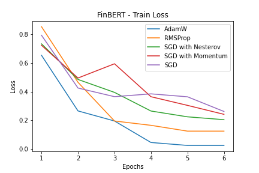
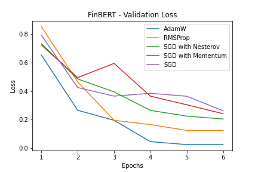

# StockTwits Sentiment Analysis

## Data:

The Stocktwits dataset consists of 64,51,067 StockTwits from the [StockTwits](https://stocktwits.com/) platform and each post has been categorised by a polarity.

The dataset has been sampled from this [repository](https://github.com/mjag7682/NLP-of-StockTwits-data-for-predicting-stocks).

The dataset contains two columns:  

- **Text**: The text contained in the StockTwit post. The text refers to information about the performance of a stock.

- **Polarity**: Contains two values ie. Negative and Positive. Negative indicates that the Stock price may from fall whereas Positive indicates an increase in price of the Stock.
   

## Experiments:

#### **RoBERTa:**

- A baseline was created using the BERT model. Training the model with an **Adam optimizer with learning rate of 3e-5** for **6 epochs** yielded an **Accuracy of 86% and an F1 Score of 0.86.**

#### **DistilBERT**

- The DistilBERT model was fine tuned on the data. Training the model with an **Adam optimizer with learning rate of 3e-5**, yielded an **Accuracy of 82% and an F1 Score of 0.81.**

#### **FINBERT**

- The FINBERT model was fine tuned on the data.Training the model with an **Adam optimizer** with learning rate of 5e-5, for **3 epochs** yielded an **Accuracy of 90.91% and an F1 Score of 0.91.**

## Results:

The best results were obtained using a fine-tuned FinBERT model. It was used for generating the final predictions.

The results from all the text classification models have been summarized below:

| Model      | Accuracy | F1 Score(Weighted) |
| ---------- | -------- | ------------------ |
| RoBERTa    | 0.67     | 0.46               |
| DistilBERT | 0.74     | 0.52               |
| FinBERT    | 82%      | 0.68               |

## Optimizers Comparison:

The optimizer hyperparamerters that were taken are shown below:

| Optimizer     | $\gamma$ (Learning Rate)  | $\eta$ Momentum  | $\alpha$ Alpha  | $\beta_1$ Beta1  | $\beta_2$ Beta2  | $\epsilon$ Epsilon  |
| ------------- | ---------------------- | --------------- | -------------- | --------------- | --------------- | ------------------ |
| AdamW         | 3e-5                   | 0.01            | 0.99            | 0.9             | 0.999           | 1e-5               |
| RMSprop       | 0.01                   | 0.01            | 0.99           | -               | -               | -                  |
| Adagrad       | 3e-5                   |                 | -              | -               | -               | -                  |
| SGD(Momentum) | 3e-5                   | 0.001           | -              | -               | -               | -                  |
| SGD           | 0.01                   |                 | -              | -               | -               | -                  |

-
**Training loss**  

**Comparing the Validation loss of all optimizers** for the fine tuned FinBERT model
 

The rate of convergence of the AdamW optimizer is the fastest.

We can conclude the order of convergence of the optimizers:
AdamW > RMSprop > NAG > SGD(Momentum) > SGD.